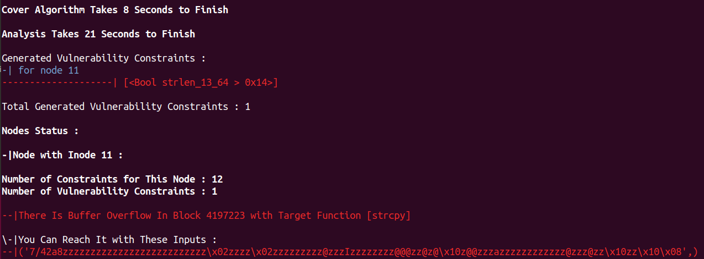

# Heap Overflow Detection Method

This tool attempts to improve the efficiency of symbolic execution technique and use it to detect heap overflow vulnerability in binary programs. Instead of applying symbolic execution to the whole program, this tool initially determines a program test unit probably containing vulnerability using static analysis and based on the specification of heap overflow vulnerability. Then the constraint tree of the program unit is extracted using symbolic execution such that every node in this constraint tree contains the desired path and vulnerability constraints. Finally, using the curve fitting technique and treatment learning, the system inputs are estimated consistent with these constraints. Thus, new inputs are generated that reach the vulnerable instructions in the desired unit from the beginning of the program and cause heap overflow in those instructions.

For more information, see the paper ["A Unit-Based Symbolic Execution Method for Detecting Heap Overflow Vulnerability in Executable Codes"](https://link.springer.com/chapter/10.1007/978-3-031-09827-7_6) presented at the Tests and Proofs (TAP) 2022 conference.

Analysis Steps 
------------
* Static Analysis on x64 Binary Codes for Finding Possibly Vulnerable Units
* Symbolic Execution on Test Units
* Monte Carlo Simulation and Curve Fitting
* Detecting Heap Overflow Vulnerability and Generating Appropriate Inputs for Vulnerability Activation

## Requirements
- Python3
- angr Framework ([Installation](https://angr.io))

Getting Started
------------
### Step 1: Creating Virtual Environment
Create and activate a virtual environment:
```
sudo apt-get install virtualenv
virtualenv -p /usr/bin/python3 env
source env/bin/activate
```
### Step 2: Cloning Files to Use Heap Overflow Detection Tool
```
git clone https://github.com/SoftwareSecurityLab/Heap-Overflow-Detection
cd Heap-Overflow-Detection
```
### Step 3: Installing Requirements
Now install project requirements using `requirements.txt` file:
```
pip install -r requirements.txt
```
Running Tests
------------
Everything is completed. Now you can test your desired code using our tool. We put some test cases from the [NIST SARD](https://samate.nist.gov/SRD/) benchmark vulnerable programs in this repository which you can use these test cases.
### Options
```
-h or --help        HELP
-b or --binary      BINARY     [The Name of Binary File You Want to Analyze]
-p or --prototype   PROTOTYPE  [The Prototype of Test Unit You Want to Analyze]
-s or --sizes       SIZES      [The Size of Test Unit Arguments]
-a or --args        ARGS       [The Indexes of Argv Passed to The Test Unit As Function Arguments]
-S or --solo        SOLO       [The Solo Mode Avoids Executing Nested Functions in Unit Symbolically]
```
### Testing Executable Code Using Heap Overflow Detection Tool
```
cd Project_Files; chmod +x run.py
```
You can see possibly vulnerable units in binary program which are need to be analyzed:
```
gcc ./samples/program.c -o program; ./run.py -b program
```
For example, you want to analyze the function "signup" as a vulnerable unit:<br />
We need two arguments with the maximum length of 100 as the inputs of "scanf" function, which activate the possible vulnerabilities in the "signup" unit, so we use `-s 100,100` for the sizes option.
```
./run.py -b program -p 'void signup(char*,char*)' -s 100,100 --solo
```
If you want to analyze the function "authentication" as a vulnerable unit:<br />
We need two arguments with the maximum length of 100 as the inputs of argv, which activate the possible vulnerabilities in the "authentication" unit, so we use `-s 100,100` for the sizes option and also since the argv[1] and argv[2] have been passed to the test unit, we use `-a 1,2` for the args option.
```
./run.py -b program -p 'void authentication(char*,char*)' -s 100,100 -a 1,2 --solo
```
We wish you happy testing!😄

Known Issues
------------
You may get the message "node i is not satisfiable" since the detection tool can not generate appropriate input data if the symbolic buffer does not have enough space to hold the generated input. In this situation, you have to increase the value of parameters in the [`config.py`](https://github.com/SoftwareSecurityLab/Heap-Overflow-Detection/blob/main/Project_Files/source/config.py) file.

## Authors
* **Maryam Mouzarani** - [maryam-mouzarani](https://github.com/maryam-mouzarani)
* **Ali Kamali** - [alikmli](https://github.com/alikmli)
* **Sara Baradaran** - [SaraBaradaran](https://github.com/SaraBaradaran)
* **Mahdi Heidari** - [mheidari98](https://github.com/mheidari98/)
## License
This project is licensed under the Apache License 2.0 - see the [LICENSE](https://github.com/SoftwareSecurityLab/Heap-Overflow-Detection/blob/main/LICENSE) file for details

Notes
------------
We have tested our project on Ubuntu 18.04.1 LTS.

<div align="center">
  <a href="https://github.com/SoftwareSecurityLab/Heap-Overflow-Detection">
    
  </a>
</div>
